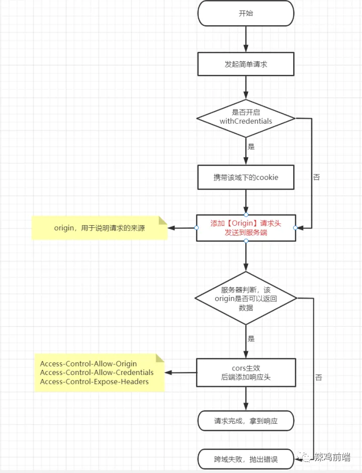
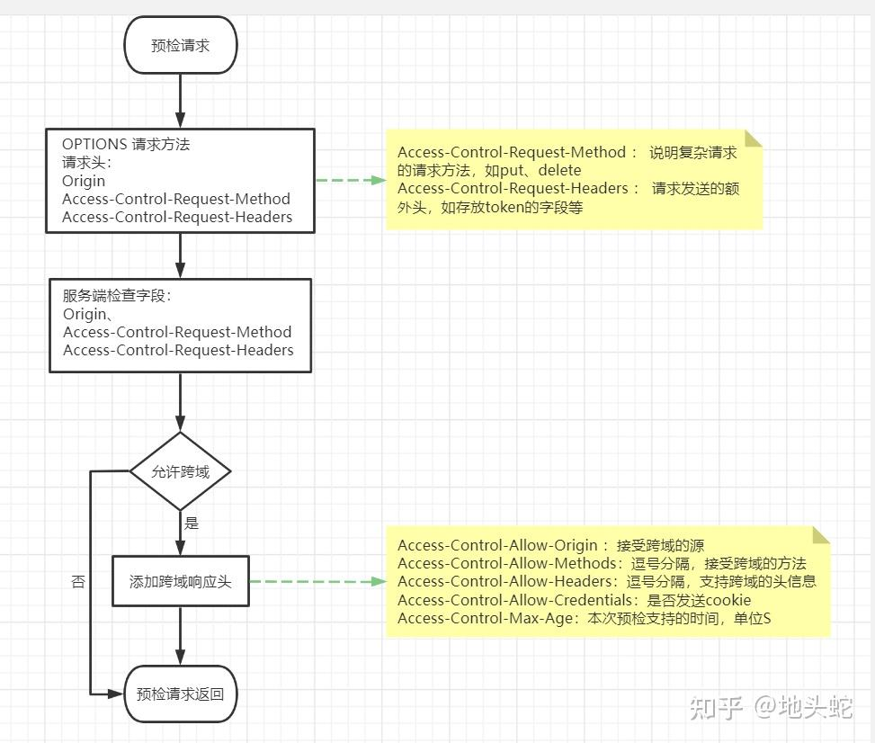

# 浏览器同源策略下的前端跨域请求

说起跨域，我们都很熟悉。尤其是在前后端分离的开发模式下，跨域问题贯穿始终，从开发联调阶段，到打版发布，都绕不开跨域问题。以下文章内容，将对工作中遇到的跨域问题，进行一下简单的总结归纳。

## 1、跨域是啥

跨域，就是在一定的条件下，获取非同源数据的能力。

跨域这种能力，源于同源策略。

同源策略，是一种为了浏览器安全而制定的策略，可以理解为，就是只能获取同源下的数据。
而同源的判定，是指的 协议+域名+端口 都一致，才是同源。

同源策略是重要的安全策略，但是某些情况，又存在获取非同源数据的需求，所以又有了跨域这种功能（注意区分跨域和同源，很多同学混淆了两个概念，把跨域当作是同源，其实跨域更应该理解为同源策略下的一个解决方案）。

跨域在浏览器的实现，叫做 CORS，全称“跨域资源共享”，是一种用于跨域的标准。

CORS 的实现，全部由浏览器进行实现，外加服务端进行一定的配合，和前端代码，并不产生直接的关系。

发起一个 CORS 请求，如果请求方法是 HEAD、GET、POST 三种方法之一，且请求头只有 Accept、Accept-Language、Content-Language、Last-Event-ID、Content-Type 这几种，那这个请求方法就是一个简单请求；如果有其他的请求方法、或者额外的请求头，那就是一个复杂请求了。

对于简单请求和复杂请求，浏览器和服务端的处理流程，存在一定的差异。

## 2、简单请求

简单请求的流程如下：

origin 请求头，用于标识请求来源的域，后端可以进行判断，是否在白名单内，如果在白名单内就进行 CORS；否则就不进行处理，浏览器会抛出 CORS 异常。

如果是可以响应 CORS 的情况，将会在响应中，添加三个响应头：

- Access-Control-Allow-Origin：用于标识允许跨域的源，给浏览器使用，如果和请求的 origin 一样，或者为\*，浏览器就将请求通过，否则依然抛出 CORS 异常
- Access-Control-Allow-Credentials：用于标识是否能发送 cookie。但是大部分浏览器的实现，都是默认会发送 cookie
- Access-Control-Expose-Headers：用于暴露额外的响应头。因为跨域请求的情况下，只能拿到一些基本的响应头，可以在这里进行设置，以用来暴露更多的响应头

更多的响应配置，可参考文档：[跨源资源共享（CORS）](https://developer.mozilla.org/zh-CN/docs/Web/HTTP/Guides/CORS#http_%E5%93%8D%E5%BA%94%E9%A6%96%E9%83%A8%E5%AD%97%E6%AE%B5)

## 3、复杂请求

复杂请求进入到服务器时，会先发起一个`需预检的请求`，就是请求方法为 `OPTIONS` 的请求。

服务器需要先处理`OPTIONS`请求，处理成功后，才会再次进入复杂请求，此时再次处理复杂请求，其流程和简单请求就一致了：

